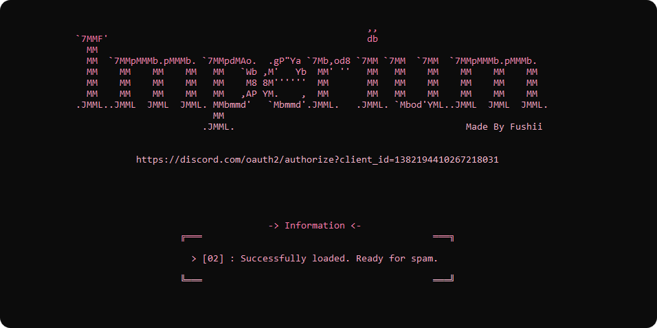

<p align="center">
	<a href="https://discord.gg/sH5Mh2XfPC"></a>
</p>

<h4 align="center">IMPERIUM TOOLS | OFFICIAL APPLICATION</h4>
<p align="center">
	Best FREE Discord tools written in Python.
</p>

<p align="center">
	<a href="#easy-installation">Installation</a> •
	<a href="https://discord.gg/sH5Mh2XfPC">Discord server</a>
</p>
<br/>

## • Screenshot

<p align="center">
  
</p>

## Easy Installation

This installation is designed for non-advanced users. To install Imperium Tools in a more "advanced" way you can follow the steps below.

```bash
1. Download this repository clicking "CODE" and "Download ZIP"
2. Extract the ZIP archive, Go into the src folder, open "setup_imperium"...
3. When you close the console you can re-open it using "start_imperium".
```
